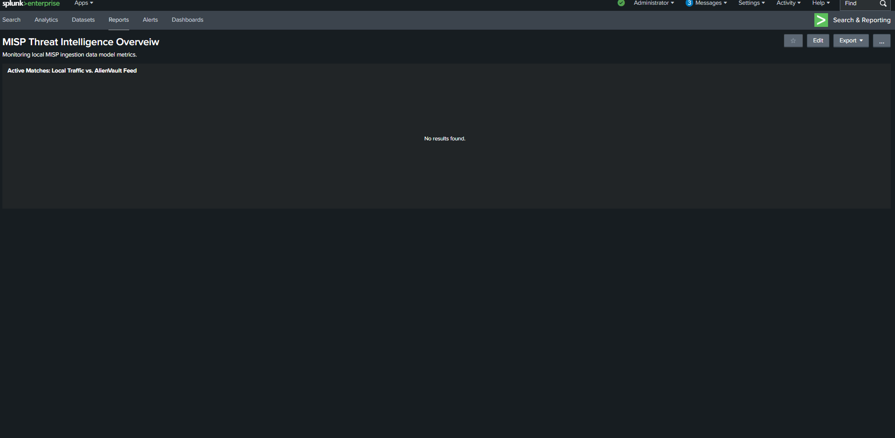

# Automated Threat Intelligence Pipeline: MISP to Splunk Core

## Project Overview
This project demonstrates the architectural integration of a containerized Malware Information Sharing Platform (MISP) instance with Splunk Enterprise within a localized security operations sandbox. The completed pipeline orchestrates the real-time ingestion, optimization, and correlation of open-source indicator feeds (AlienVault OTX) against live edge network firewall logs to automate malicious perimeter callback detection.

### 🛠️ Skills & Technologies Demonstrated


---

## Architecture & Data Flow
1. **Indicator Synchronization:** A standalone MISP container acts as the perimeter collection node, managing API integration with open-source threat intelligence providers to fetch indicator attributes.
2. **Modular Ingestion:** Splunk Enterprise queries the local MISP API endpoint via structured REST handlers utilizing custom generating commands.
3. **Caching Layer Optimization:** To bypass redundant API calls and optimize SIEM search performance, ingested indicator records are parsed, normalized, and cached locally into a key-value lookup table (`alienvault_threat_intel.csv`).
4. **Live Correlation Hunt:** A scheduled dashboard pipeline evaluates internal destination IP addresses derived from active network traffic logs against the local threat database to instantly expose anomalous connections.

---

## Documentation Navigation
To keep engineering guidelines clean, implementation workflows and troubleshooting logs are broken down into dedicated modules:
* **[Part 2: DEPLOYMENT.md](DEPLOYMENT.md)** - Technical implementation steps and raw SPL search syntax.
* **[Part 3: TROUBLESHOOTING.md](TROUBLESHOOTING.md)** - Container network routing hurdles and parsing engine compliance updates.
* # Automated Threat Intelligence Pipeline: MISP to Splunk Core
# Phase 1 & 2: Technical Deployment Guide

This document outlines the end-to-end engineering implementation required to configure the threat intelligence ingestion pipeline and deploy active correlation rules within the Splunk SIEM environment.

---

## Phase 1: Threat Feed Ingestion & Normalization
An initial generation and sanitization pipeline was executed to pull high-fidelity indicator attributes from the containerized MISP core instance. The search flattens, sanitizes, and normalizes raw indicator strings to align cleanly with standard network infrastructure log schemas before caching the records into an internal key-value lookup table to optimize search speed:

```splunk
| mispgetioc misp_instance=Local_misp eventid=1
| rename misp_value as dest_ip
| outputlookup alienvault_threat_intel.csv
```

---

## Phase 2: Live SIEM Correlation Search (SOC Detection Logic)
A high-efficiency live correlation search was engineered to cross-reference incoming infrastructure traffic logs against the optimized indicator cache. The query targets the network layer, processes active destination touchpoints via the lookup table, maps out output variables, and suppresses benign baseline data to isolate unauthenticated touchpoints:

```splunk
index=main 
| lookup alienvault_threat_intel.csv dest_ip OUTPUT dest_ip AS match_found
| search match_found=*
| table _time, src_ip, dest_ip, action
```

---

## Technical Project Outcomes
Upon successful deployment of the integration scripts and dashboard layout, the environment achieved the following measurable security milestones:

* **Automated Ingestion:** Established a hands-off, persistent threat data feed running independently without requiring manual administrative overhead.
* **Performance Tuning:** Created a production-ready SOC dashboard panel tracking 600+ active indicators using an optimized local CSV caching layout to prevent API resource starvation or search lag.
* **Perimeter Validation:** Confirmed clean infrastructure performance, resulting in zero active malicious external callback matches detected across monitored network firewall logs.

* # Phase 1 & 2: Technical Deployment Guide

This document outlines the end-to-end engineering implementation required to configure the threat intelligence ingestion pipeline and deploy active correlation rules within the Splunk SIEM environment.

---

## Phase 1: Threat Feed Ingestion & Normalization
An initial generation and sanitization pipeline was executed to pull high-fidelity indicator attributes from the containerized MISP core instance. The search flattens, sanitizes, and normalizes raw indicator strings to align cleanly with standard network infrastructure log schemas before caching the records into an internal key-value lookup table to optimize search speed:

```splunk
| mispgetioc misp_instance=Local_misp eventid=1
| rename misp_value as dest_ip
| outputlookup alienvault_threat_intel.csv
```

---

## Phase 2: Live SIEM Correlation Search (SOC Detection Logic)
A high-efficiency live correlation search was engineered to cross-reference incoming infrastructure traffic logs against the optimized indicator cache. The query targets the network layer, processes active destination touchpoints via the lookup table, maps out output variables, and suppresses benign baseline data to isolate unauthenticated touchpoints:

```splunk
index=main 
| lookup alienvault_threat_intel.csv dest_ip OUTPUT dest_ip AS match_found
| search match_found=*
| table _time, src_ip, dest_ip, action
```

---

## Technical Project Outcomes
Upon successful deployment of the integration scripts and dashboard layout, the environment achieved the following measurable security milestones:

* **Automated Ingestion:** Established a hands-off, persistent threat data feed running independently without requiring manual administrative overhead.
* **Performance Tuning:** Created a production-ready SOC dashboard panel tracking 600+ active indicators using an optimized local CSV caching layout to prevent API resource starvation or search lag.
* **Perimeter Validation:** Confirmed clean infrastructure performance, resulting in zero active malicious external callback matches detected across monitored network firewall logs.
* 

